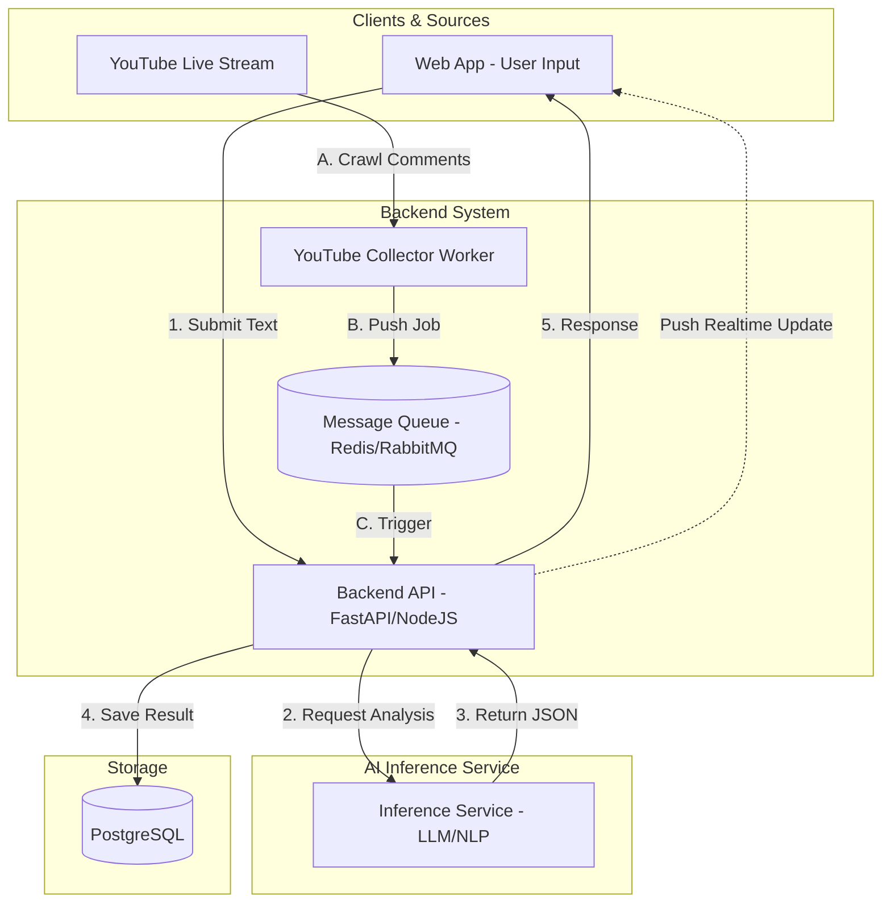

Chào bạn, đây là giải pháp kiến trúc và thiết kế cơ sở dữ liệu cho yêu cầu của bạn. Hệ thống này được thiết kế để vừa xử lý dữ liệu tức thời từ người dùng (Web UI), vừa xử lý dữ liệu dòng chảy (Streaming) từ YouTube.

### 1. Sơ đồ kiến trúc (System Architecture)

Dưới đây là sơ đồ mô tả luồng dữ liệu:



---

### 2. Tích hợp YouTube Streaming

Để tích hợp YouTube Live, chúng ta cần thêm một thành phần **Worker**:

1.  **YouTube Collector Worker**: Sử dụng thư viện như `pytchat` (Python) hoặc YouTube Data API v3 để lắng nghe comment.
2.  **Cơ chế đẩy dữ liệu**: 
    *   Vì YouTube comment có thể đến rất nhanh, nên dùng một **Message Queue (Redis)** để tránh làm nghẽn Backend.
    *   Backend sẽ lấy từng comment từ hàng đợi, gửi sang **Inference Service** để phân tích, sau đó lưu vào **Postgres**.
    *   Sử dụng **WebSockets** hoặc **Server-Sent Events (SSE)** để đẩy kết quả từ Backend lên giao diện Web App ngay lập tức mà người dùng không cần load lại trang.

---

### 3. Thiết kế Database (PostgreSQL)

Với mục tiêu demo đơn giản nhưng vẫn quản lý được dữ liệu phức tạp của bạn, chúng ta sẽ sử dụng kiểu dữ liệu `JSONB` trong Postgres để lưu trữ phần `reasoning_scaffolding` cho linh hoạt, hoặc tách ra các cột nếu muốn truy vấn sâu.

#### Bảng: `analysis_results`

| Cột | Kiểu dữ liệu | Mô tả |
| :--- | :--- | :--- |
| `id` | SERIAL (PK) | ID tự tăng |
| `source` | VARCHAR(50) | 'web_input' hoặc 'youtube_live' |
| `raw_text` | TEXT | Nội dung gốc người dùng nhập/comment |
| `semantic_decoding` | TEXT | Giải mã ngữ nghĩa |
| `slang_interpretation` | TEXT | Giải thích teencode/slang |
| `contextual_conflict` | TEXT | Xung đột ngữ cảnh |
| `target` | VARCHAR(255) | Đối tượng mục tiêu |
| `thought_trace` | TEXT | Suy luận logic cuối cùng |
| `final_label` | VARCHAR(100) | Nhãn cuối cùng (e.g., Toxic, Positive,...) |
| `created_at` | TIMESTAMP | Thời gian tạo |

#### SQL Script tạo bảng:

```sql
CREATE TABLE analysis_results (
    id SERIAL PRIMARY KEY,
    source VARCHAR(50) NOT NULL, -- 'web' hoặc 'youtube'
    raw_text TEXT NOT NULL,
    
    -- Các trường từ reasoning_scaffolding
    semantic_decoding TEXT,
    slang_interpretation TEXT,
    contextual_conflict TEXT,
    target VARCHAR(255),
    
    -- Trace và Label
    thought_trace TEXT,
    final_label VARCHAR(100),
    
    created_at TIMESTAMP DEFAULT CURRENT_TIMESTAMP
);

-- Index để tìm kiếm nhanh label hoặc source
CREATE INDEX idx_final_label ON analysis_results(final_label);
CREATE INDEX idx_source ON analysis_results(source);
```

---

### 4. Luồng xử lý dữ liệu (Example Code Logic)

Khi Backend nhận được output từ Inference Service, nó sẽ thực hiện logic như sau (ví dụ bằng Python/FastAPI):

```python
# Giả sử đây là output từ AI Model
ai_output = {
  "reasoning_scaffolding": {
    "semantic_decoding": "...",
    "slang_interpretation": "...",
    "contextual_conflict": "...",
    "target": "..."
  },
  "thought_trace": "...",
  "final_label": "..."
}

# Logic lưu vào Database
query = """
INSERT INTO analysis_results (
    source, raw_text, semantic_decoding, slang_interpretation, 
    contextual_conflict, target, thought_trace, final_label
) VALUES (%s, %s, %s, %s, %s, %s, %s, %s)
"""

values = (
    "youtube", 
    original_comment,
    ai_output['reasoning_scaffolding']['semantic_decoding'],
    ai_output['reasoning_scaffolding']['slang_interpretation'],
    ai_output['reasoning_scaffolding']['contextual_conflict'],
    ai_output['reasoning_scaffolding']['target'],
    ai_output['thought_trace'],
    ai_output['final_label']
)
# Thực thi query...
```

### Tại sao chọn kiến trúc này?
1.  **Tính mở rộng**: Sau này bạn có thể thêm TikTok Live hoặc Facebook Live chỉ bằng cách thêm 1 Worker mới mà không cần sửa Backend.
2.  **Tính ổn định**: Message Queue giúp hệ thống không bị "sập" khi AI Inference xử lý chậm hơn tốc độ comment đổ về.
3.  **Dễ demo**: PostgreSQL cho phép bạn dùng SQL để thống kê (ví dụ: đếm xem có bao nhiêu comment Toxic từ YouTube trong 5 phút qua).